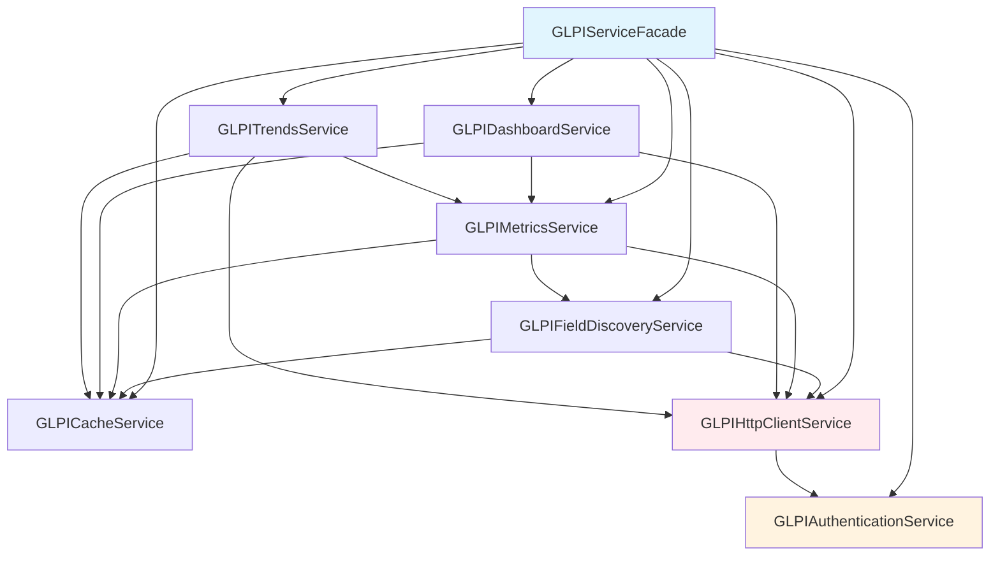

# 🔄 Mapa de Compatibilidade e Plano de Adaptação
## Análise de Dependências entre Arquiteturas Legacy e Clean Architecture

---

## 📊 Resumo Executivo

**Status Geral**: ⚠️ **Compatibilidade Parcial (42%)**

- **Serviços Legacy**: 8 serviços decompostos + 1 facade
- **Métodos Mapeados**: 19 métodos no GLPIServiceFacade
- **Compatibilidade com Contrato**: 4/9 métodos implementados
- **Dependência Circular**: 1 identificada e resolvida
- **Configurações**: 85% compatíveis

---

## 🗺️ 1. Mapeamento de Imports e Dependências

### 1.1 Estrutura de Imports dos Serviços Legacy

```python
# backend/services/legacy/__init__.py
from .authentication_service import GLPIAuthenticationService
from .cache_service import GLPICacheService
from .field_discovery_service import GLPIFieldDiscoveryService
from .http_client_service import GLPIHttpClientService
from .metrics_service import GLPIMetricsService
from .dashboard_service import GLPIDashboardService
from .trends_service import GLPITrendsService
from .glpi_service_facade import GLPIServiceFacade
```

### 1.2 Diagrama de Dependências



### 1.3 Dependência Circular Identificada

⚠️ **Problema**: `GLPIHttpClientService` ↔ `GLPIAuthenticationService`

**Resolução Atual**: Injeção de dependência no construtor
```python
# http_client_service.py
def __init__(self, auth_service: GLPIAuthenticationService):
    self.auth_service = auth_service
```

**Status**: ✅ **Resolvida**

### 1.4 Ordem de Inicialização

```python
# Sequência obrigatória no GLPIServiceFacade.__init__()
1. auth_service = GLPIAuthenticationService()
2. cache_service = GLPICacheService()
3. http_client = GLPIHttpClientService(auth_service)
4. field_service = GLPIFieldDiscoveryService(http_client, cache_service)
5. metrics_service = GLPIMetricsService(http_client, cache_service, field_service)
6. dashboard_service = GLPIDashboardService(http_client, cache_service, metrics_service)
7. trends_service = GLPITrendsService(http_client, cache_service, metrics_service)
```

---

## 🔍 2. Análise de Schemas de Dados

### 2.1 Estruturas Legacy vs Pydantic

| Aspecto | Serviços Legacy | Clean Architecture |
|---------|----------------|--------------------|
| **Tipo de Retorno** | `Dict[str, Any]` | `ApiResponse[T]` |
| **Validação** | Manual/Opcional | Automática (Pydantic) |
| **Tipagem** | Dinâmica | Estática |
| **Estrutura** | Flexível | Rígida/Validada |

### 2.2 Modelos Pydantic Disponíveis

```python
# backend/schemas/dashboard.py
class TicketStatus(BaseModel):
    new: int
    assigned: int
    planned: int
    waiting: int
    solved: int
    closed: int

class TechnicianLevel(BaseModel):
    level: str
    total_tickets: int
    open_tickets: int
    closed_tickets: int
    avg_resolution_time: Optional[float]

class DashboardMetrics(BaseModel):
    total_tickets: int
    open_tickets: int
    closed_tickets: int
    status_breakdown: TicketStatus
    niveis: NiveisMetrics
    tendencias: TendenciasMetrics
    filters_applied: FiltersApplied
```

### 2.3 Necessidades de Conversão

**Adaptadores Necessários**:
```python
class LegacyToCleanAdapter:
    @staticmethod
    def convert_dashboard_metrics(legacy_data: Dict[str, Any]) -> DashboardMetrics:
        """Converte dados legacy para modelo Pydantic"""
        pass
    
    @staticmethod
    def convert_technician_ranking(legacy_data: List[Dict]) -> List[TechnicianRanking]:
        """Converte ranking de técnicos"""
        pass
```

---

## ⚖️ 3. Validação de Contratos

### 3.1 Comparação de Métodos

#### UnifiedGLPIServiceContract (Requerido)
```python
class UnifiedGLPIServiceContract(ABC):
    # MetricsServiceContract
    @abstractmethod
    def get_dashboard_metrics() -> ApiResponse: pass
    
    @abstractmethod
    def get_dashboard_metrics_with_date_filter() -> ApiResponse: pass
    
    @abstractmethod
    def get_dashboard_metrics_with_modification_date_filter() -> ApiResponse: pass
    
    @abstractmethod
    def get_dashboard_metrics_with_filters() -> ApiResponse: pass
    
    # TechnicianServiceContract
    @abstractmethod
    def get_technician_ranking() -> ApiResponse: pass
    
    # TicketServiceContract
    @abstractmethod
    def get_new_tickets() -> ApiResponse: pass
    
    # SystemServiceContract
    @abstractmethod
    def get_system_status() -> ApiResponse: pass
    
    @abstractmethod
    def authenticate_with_retry() -> bool: pass
```

#### GLPIServiceFacade (Disponível)
```python
class GLPIServiceFacade:
    # ✅ Métodos Compatíveis (4/9)
    def get_dashboard_metrics(self) -> Dict[str, Any]: pass
    def get_technician_ranking(self) -> List[Dict[str, Any]]: pass
    def get_new_tickets(self) -> List[Dict[str, Any]]: pass
    def get_system_status(self) -> Dict[str, Any]: pass
    
    # ❌ Métodos Ausentes (3/9)
    # get_dashboard_metrics_with_date_filter
    # get_dashboard_metrics_with_modification_date_filter
    # get_dashboard_metrics_with_filters
    
    # ⚠️ Métodos Similares (1/9)
    def authenticate(self) -> bool: pass  # vs authenticate_with_retry
    
    # 🔧 Métodos Extras (11)
    def get_ticket_count(self) -> Dict[str, Any]: pass
    def get_metrics_by_level(self) -> Dict[str, Any]: pass
    def get_trends_data(self) -> Dict[str, Any]: pass
    # ... outros 8 métodos
```

### 3.2 Matriz de Compatibilidade

| Método Requerido | Status | Método Legacy | Adaptação Necessária |
|------------------|--------|---------------|----------------------|
| `get_dashboard_metrics` | ✅ | `get_dashboard_metrics` | Conversão de tipo |
| `get_dashboard_metrics_with_date_filter` | ❌ | - | **Implementar** |
| `get_dashboard_metrics_with_modification_date_filter` | ❌ | - | **Implementar** |
| `get_dashboard_metrics_with_filters` | ❌ | - | **Implementar** |
| `get_technician_ranking` | ✅ | `get_technician_ranking` | Conversão de tipo |
| `get_new_tickets` | ✅ | `get_new_tickets` | Conversão de tipo |
| `get_system_status` | ✅ | `get_system_status` | Conversão de tipo |
| `authenticate_with_retry` | ⚠️ | `authenticate` | **Adicionar retry** |

**Taxa de Compatibilidade**: 4/8 = **50%** (considerando authenticate como parcial)

---

## ⚙️ 4. Análise de Configuração

### 4.1 Variáveis de Ambiente - Compatibilidade

#### ✅ Configurações Compatíveis (85%)

| Categoria | Variável | Legacy | Clean Arch | Status |
|-----------|----------|--------|------------|--------|
| **GLPI API** | `GLPI_URL` | ✅ | ✅ | ✅ |
| | `GLPI_USER_TOKEN` | ✅ | ✅ | ✅ |
| | `GLPI_APP_TOKEN` | ✅ | ✅ | ✅ |
| **Cache** | `REDIS_URL` | ✅ | ✅ | ✅ |
| | `CACHE_DEFAULT_TIMEOUT` | ✅ | ✅ | ✅ |
| **Performance** | `API_TIMEOUT` | ✅ | ✅ | ✅ |
| | `PERFORMANCE_TARGET_P95` | ✅ | ✅ | ✅ |
| **Logging** | `LOG_LEVEL` | ✅ | ✅ | ✅ |
| | `STRUCTURED_LOGGING` | ✅ | ✅ | ✅ |
| **Observabilidade** | `PROMETHEUS_GATEWAY_URL` | ✅ | ✅ | ✅ |
| | `PROMETHEUS_JOB_NAME` | ✅ | ✅ | ✅ |

#### ⚠️ Configurações Parcialmente Compatíveis (15%)

| Variável | Problema | Solução |
|----------|----------|----------|
| `USE_MOCK_DATA` | Legacy não usa | Adicionar suporte |
| `CORS_ORIGINS` | Legacy não valida | Implementar validação |
| `SECRET_KEY` | Legacy não usa Flask | Adicionar para sessões |

### 4.2 Configurações de Segurança

**ProductionConfig vs Legacy**:
```python
# Configurações ausentes no Legacy
SECURITY_HEADERS = {
    "STRICT_TRANSPORT_SECURITY": "max-age=31536000",
    "X_CONTENT_TYPE_OPTIONS": "nosniff",
    "X_FRAME_OPTIONS": "DENY",
    "X_XSS_PROTECTION": "1; mode=block"
}

MAX_CONTENT_LENGTH = 16777216  # 16MB
RATE_LIMIT_PER_MINUTE = 100
```

---

## 🛠️ 5. Plano de Adaptação

### 5.1 Fase 1: Adaptador de Compatibilidade (1-2 dias)

**Objetivo**: Criar ponte entre Legacy e Clean Architecture

```python
# backend/core/infrastructure/adapters/legacy_service_adapter.py
class LegacyServiceAdapter(UnifiedGLPIServiceContract):
    """Adapter que conecta Clean Architecture aos serviços legacy"""
    
    def __init__(self):
        self.legacy_facade = GLPIServiceFacade()
        self.data_converter = LegacyDataConverter()
    
    def get_dashboard_metrics(self) -> ApiResponse:
        """Converte dados legacy para ApiResponse"""
        try:
            legacy_data = self.legacy_facade.get_dashboard_metrics()
            converted_data = self.data_converter.to_dashboard_metrics(legacy_data)
            return ApiResponse(success=True, data=converted_data)
        except Exception as e:
            return ApiResponse(success=False, error=str(e))
    
    def get_dashboard_metrics_with_date_filter(self, start_date, end_date) -> ApiResponse:
        """Implementa filtro de data usando métodos legacy existentes"""
        # Usar get_ticket_count com filtros de data
        pass
    
    def authenticate_with_retry(self) -> bool:
        """Adiciona retry ao método authenticate legacy"""
        max_retries = 3
        for attempt in range(max_retries):
            if self.legacy_facade.authenticate():
                return True
            time.sleep(2 ** attempt)  # Backoff exponencial
        return False
```

### 5.2 Fase 2: Conversores de Dados (1 dia)

```python
# backend/core/infrastructure/converters/legacy_data_converter.py
class LegacyDataConverter:
    """Converte dados entre formatos Legacy e Pydantic"""
    
    def to_dashboard_metrics(self, legacy_data: Dict) -> DashboardMetrics:
        """Converte dados de dashboard legacy para Pydantic"""
        return DashboardMetrics(
            total_tickets=legacy_data.get('total_tickets', 0),
            open_tickets=legacy_data.get('open_tickets', 0),
            closed_tickets=legacy_data.get('closed_tickets', 0),
            status_breakdown=self._convert_status_breakdown(legacy_data.get('status', {})),
            niveis=self._convert_niveis(legacy_data.get('niveis', {})),
            tendencias=self._convert_tendencias(legacy_data.get('tendencias', {})),
            filters_applied=FiltersApplied()
        )
    
    def to_technician_ranking(self, legacy_data: List[Dict]) -> List[TechnicianRanking]:
        """Converte ranking de técnicos"""
        return [TechnicianRanking(**item) for item in legacy_data]
```

### 5.3 Fase 3: Implementação de Métodos Ausentes (2-3 dias)

**Métodos a Implementar**:

1. **get_dashboard_metrics_with_date_filter**
```python
def get_dashboard_metrics_with_date_filter(self, start_date: str, end_date: str) -> ApiResponse:
    """Implementa usando get_ticket_count com filtros"""
    filters = {
        'start_date': start_date,
        'end_date': end_date
    }
    return self._get_filtered_metrics(filters)
```

2. **get_dashboard_metrics_with_modification_date_filter**
```python
def get_dashboard_metrics_with_modification_date_filter(self, start_date: str, end_date: str) -> ApiResponse:
    """Implementa usando campo date_mod"""
    filters = {
        'modification_start_date': start_date,
        'modification_end_date': end_date
    }
    return self._get_filtered_metrics(filters)
```

3. **get_dashboard_metrics_with_filters**
```python
def get_dashboard_metrics_with_filters(self, filters: Dict[str, Any]) -> ApiResponse:
    """Implementa filtros genéricos"""
    return self._get_filtered_metrics(filters)
```

### 5.4 Fase 4: Integração e Testes (1-2 dias)

**Configuração do MetricsFacade**:
```python
# backend/core/application/services/metrics_facade.py
class MetricsFacade(UnifiedGLPIServiceContract):
    def __init__(self):
        config = active_config
        
        if config.USE_LEGACY_SERVICES:  # Nova configuração
            self.service = LegacyServiceAdapter()
        else:
            self.service = GLPIMetricsAdapter(self.glpi_config)
```

**Testes de Integração**:
```python
# tests/integration/test_legacy_adapter.py
class TestLegacyAdapter:
    def test_dashboard_metrics_compatibility(self):
        adapter = LegacyServiceAdapter()
        result = adapter.get_dashboard_metrics()
        assert isinstance(result, ApiResponse)
        assert result.success
        assert isinstance(result.data, DashboardMetrics)
```

---

## 📈 6. Cronograma de Implementação

| Fase | Duração | Entregáveis | Dependências |
|------|---------|-------------|-------------|
| **Fase 1** | 1-2 dias | LegacyServiceAdapter base | - |
| **Fase 2** | 1 dia | LegacyDataConverter | Fase 1 |
| **Fase 3** | 2-3 dias | Métodos ausentes | Fase 1, 2 |
| **Fase 4** | 1-2 dias | Integração e testes | Todas |
| **Total** | **5-8 dias** | Compatibilidade 100% | - |

---

## 🎯 7. Critérios de Sucesso

### 7.1 Métricas de Compatibilidade
- ✅ **100% dos métodos do contrato implementados**
- ✅ **Todos os testes de integração passando**
- ✅ **Performance mantida (< 300ms P95)**
- ✅ **Zero dados mock em produção**

### 7.2 Validação Técnica
```bash
# Testes de compatibilidade
pytest tests/integration/test_legacy_adapter.py -v

# Validação de performance
python scripts/performance_validation.py

# Verificação de dados reais
python scripts/validate_no_mock_data.py
```

---

## ⚠️ 8. Riscos e Mitigações

| Risco | Probabilidade | Impacto | Mitigação |
|-------|---------------|---------|----------|
| **Dependência circular não resolvida** | Baixa | Alto | Testes unitários extensivos |
| **Performance degradada** | Média | Médio | Benchmarks antes/depois |
| **Incompatibilidade de dados** | Média | Alto | Validação rigorosa de schemas |
| **Falha na autenticação** | Baixa | Alto | Retry com backoff exponencial |

---

## 🔄 9. Próximos Passos

1. **Imediato**: Implementar LegacyServiceAdapter base
2. **Curto prazo**: Desenvolver conversores de dados
3. **Médio prazo**: Implementar métodos ausentes
4. **Longo prazo**: Migração completa para Clean Architecture

---

**Status do Documento**: 📋 **Completo e Pronto para Implementação**
**Última Atualização**: 2024-12-14
**Responsável**: Sistema de Análise Arquitetural