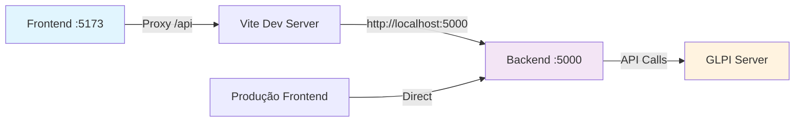
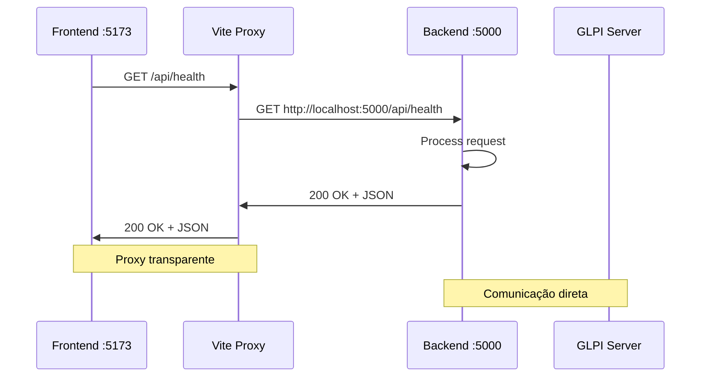
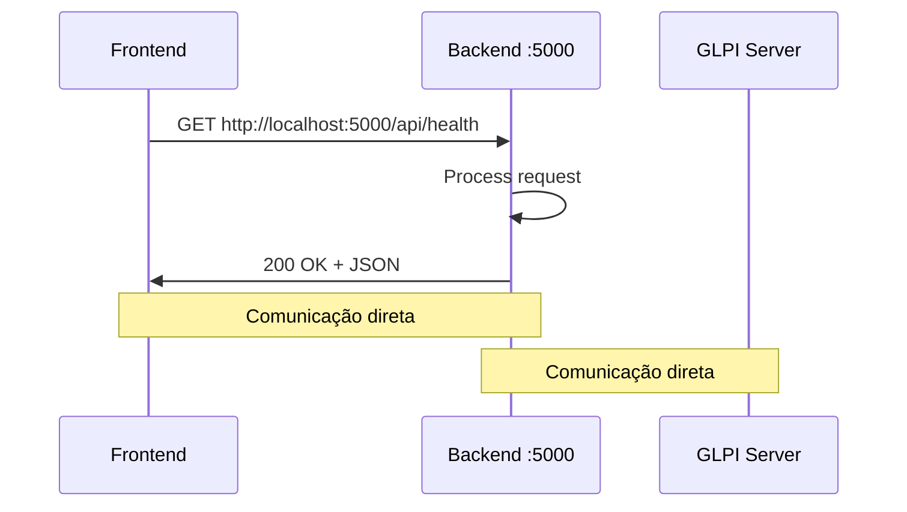

# 📚 Base de Conhecimento - Configurações GLPI Dashboard

## 🎯 Visão Geral
Este documento mapeia as configurações **corretas e funcionais** do GLPI Dashboard após as correções implementadas. Serve como referência para manter a comunicação API → Backend → Frontend → Dashboard funcionando perfeitamente.

---

## 🏗️ Arquitetura de Comunicação



---

## 🎨 FRONTEND - Configurações Corretas

### 📄 **httpClient.ts** - ⭐ CONFIGURAÇÃO CRÍTICA

```typescript
// frontend/services/httpClient.ts
import axios from 'axios';

// Função que determina a URL base da API baseada no ambiente
function getApiBaseUrl(): string {
  // Em desenvolvimento, usa proxy relativo
  if (import.meta.env.DEV) {
    return '/api';  // ⭐ LINHA CRÍTICA - Usa proxy do Vite
  }
  
  // Em produção, usa URL absoluta das variáveis de ambiente
  return import.meta.env.VITE_API_BASE_URL || 'http://localhost:5000';
}

export const API_CONFIG = {
  BASE_URL: getApiBaseUrl(),
  TIMEOUT: parseInt(import.meta.env.VITE_API_TIMEOUT || '30000'),
  RETRY_ATTEMPTS: parseInt(import.meta.env.VITE_API_RETRY_ATTEMPTS || '3'),
  RETRY_DELAY: parseInt(import.meta.env.VITE_API_RETRY_DELAY || '1000'),
};

// Configuração do cliente HTTP
const httpClient = axios.create({
  baseURL: API_CONFIG.BASE_URL,
  timeout: API_CONFIG.TIMEOUT,
  headers: {
    'Content-Type': 'application/json',
  },
});
```

**🎯 Por que funciona:**
- **Desenvolvimento**: `'/api'` → Vite proxy redireciona para backend
- **Produção**: URL absoluta das variáveis de ambiente
- **Flexível**: Configurável via variáveis de ambiente

---

### 📄 **vite.config.ts** - Configuração do Proxy

```typescript
// frontend/vite.config.ts
import { defineConfig } from 'vite';
import react from '@vitejs/plugin-react';

export default defineConfig({
  plugins: [react()],
  server: {
    host: '0.0.0.0',
    port: 5173,  // Porta do frontend
    proxy: {
      '/api': {
        target: 'http://localhost:5000',  // Backend
        changeOrigin: true,
        secure: false,
      },
    },
  },
});
```

**🎯 Fluxo do Proxy:**
1. Frontend faz requisição para `/api/health`
2. Vite intercepta e redireciona para `http://localhost:5000/api/health`
3. Backend responde
4. Vite retorna resposta para frontend

---

### 📄 **frontend/.env.example** - Variáveis de Ambiente

```bash
# 🌐 Configurações da API
VITE_API_BASE_URL=http://localhost:5000
VITE_API_TIMEOUT=30000
VITE_API_RETRY_ATTEMPTS=3
VITE_API_RETRY_DELAY=1000

# 📊 Configurações de Log e Debug
VITE_LOG_LEVEL=info
VITE_SHOW_PERFORMANCE=false
VITE_SHOW_API_CALLS=false
VITE_SHOW_CACHE_HITS=false

# 🎯 Configurações de Ambiente
VITE_APP_NAME=GLPI Dashboard
VITE_APP_VERSION=1.0.0
```

---

### 📄 **frontend/src/config/environment.ts** - Configurações Centralizadas

```typescript
export const ENV_CONFIG = {
  // 📊 Configurações de Log
  LOG_LEVEL: import.meta.env.VITE_LOG_LEVEL || 'info',
  SHOW_API_CALLS: import.meta.env.VITE_SHOW_API_CALLS === 'true',
  SHOW_PERFORMANCE: import.meta.env.VITE_SHOW_PERFORMANCE === 'true',
  
  // 🎯 Ambiente
  IS_DEVELOPMENT: import.meta.env.DEV,
  IS_PRODUCTION: import.meta.env.PROD,
  MODE: import.meta.env.MODE,
  
  // 🌐 API
  API_BASE_URL: import.meta.env.VITE_API_BASE_URL || 'http://localhost:5000',
  API_TIMEOUT: parseInt(import.meta.env.VITE_API_TIMEOUT || '30000'),
};

export function getCurrentEnvironment(): 'development' | 'production' | 'test' {
  if (import.meta.env.DEV) return 'development';
  if (import.meta.env.PROD) return 'production';
  return 'test';
}
```

---

### 📄 **frontend/src/config/appConfig.ts** - Configuração Principal

```typescript
import { API_CONFIG } from '../services/httpClient';
import { ENV_CONFIG, getCurrentEnvironment } from './environment';

const endpointsConfig = {
  dashboard: '/dashboard',
  metrics: '/metrics',
  ranking: '/ranking',
  tickets: '/tickets',
  health: '/health',
};

const environmentConfigs = {
  development: {
    enableDebug: true,
    apiTimeout: 30000,
  },
  production: {
    enableDebug: false,
    apiTimeout: 90000,
  },
};

export const appConfig = {
  api: {
    ...API_CONFIG,
    endpoints: endpointsConfig,
  },
  environment: {
    ...ENV_CONFIG,
    ...environmentConfigs[getCurrentEnvironment()],
  },
};

export function getApiUrl(endpoint: keyof typeof endpointsConfig): string {
  const baseUrl = appConfig.api.BASE_URL;
  const endpointPath = endpointsConfig[endpoint];
  
  if (baseUrl === '/api') {
    return `${baseUrl}${endpointPath}`;
  }
  
  return `${baseUrl}/api${endpointPath}`;
}
```

---

## 🔧 BACKEND - Configurações Corretas

### 📄 **backend/config/settings.py** - Configurações Principais

```python
# backend/config/settings.py
class Config:
    # 🌐 Configurações de Rede
    HOST = os.getenv('HOST', '0.0.0.0')
    PORT = int(os.getenv('PORT', 5000))
    
    # 🌍 CORS - CRÍTICO para comunicação frontend
    @property
    def CORS_ORIGINS(self) -> list:
        origins = os.getenv('CORS_ORIGINS', 
            'http://localhost:3000,http://localhost:5173,http://localhost:3001')
        return origins.split(',') if isinstance(origins, str) else origins
    
    # 🔗 URLs de API
    GLPI_URL = os.getenv('GLPI_URL', 'http://cau.ppiratini.intra.rs.gov.br/glpi/apirest.php')
    BACKEND_API_URL = os.getenv('BACKEND_API_URL', 'http://localhost:5000')
    
    # 🔐 Tokens GLPI
    GLPI_USER_TOKEN = os.getenv('GLPI_USER_TOKEN')
    GLPI_APP_TOKEN = os.getenv('GLPI_APP_TOKEN')
```

---

### 📄 **Arquivos de Ambiente**

#### **.env** (Raiz do Projeto)
```bash
# 🌐 Configurações de Rede
PORT=5000
HOST=0.0.0.0
GLPI_URL=http://cau.ppiratini.intra.rs.gov.br/glpi/apirest.php
BACKEND_API_URL=http://localhost:5000
CORS_ORIGINS=http://localhost:3000,http://localhost:5173,http://localhost:3001

# 🔐 Tokens GLPI
GLPI_USER_TOKEN=TQdSxqg2e56PfF8ZJSX3iEJ1wCpHwhCkQJ2QtRnq
GLPI_APP_TOKEN=aY3f9F5aNHJmY8op0vTE4koguiPwpEYANp1JULid

# ⚡ Performance
API_TIMEOUT=30
CACHE_DEFAULT_TIMEOUT=300

# 📊 Observabilidade
LOG_LEVEL=INFO
ENABLE_METRICS=true
ENABLE_TRACING=false
```

#### **backend/.env** (Backend Específico)
```bash
# 🔧 Configurações Flask
FLASK_APP=app.py
FLASK_ENV=development
FLASK_DEBUG=1

# 🌐 Configurações de Rede
PORT=5000
HOST=0.0.0.0
GLPI_URL=http://cau.ppiratini.intra.rs.gov.br/glpi/apirest.php
BACKEND_API_URL=http://localhost:5000
CORS_ORIGINS=http://localhost:3000,http://localhost:5173,http://localhost:3001

# 🔐 Tokens GLPI
GLPI_USER_TOKEN=TQdSxqg2e56PfF8ZJSX3iEJ1wCpHwhCkQJ2QtRnq
GLPI_APP_TOKEN=aY3f9F5aNHJmY8op0vTE4koguiPwpEYANp1JULid

# 🗄️ Cache Redis
REDIS_URL=redis://localhost:6379/0
CACHE_TYPE=redis
CACHE_DEFAULT_TIMEOUT=300

# 📊 Observabilidade
LOG_LEVEL=DEBUG
ENABLE_METRICS=true
ENABLE_TRACING=true
```

#### **docker.env** (Produção)
```bash
# 🐳 Configurações Docker - Produção

# 🌐 Configurações GLPI
GLPI_URL=http://cau.ppiratini.intra.rs.gov.br/glpi/apirest.php
GLPI_USER_TOKEN=TQdSxqg2e56PfF8ZJSX3iEJ1wCpHwhCkQJ2QtRnq
GLPI_APP_TOKEN=aY3f9F5aNHJmY8op0vTE4koguiPwpEYANp1JULid

# 🔧 Configurações Flask
FLASK_APP=app.py
FLASK_ENV=production
FLASK_DEBUG=0

# 🌐 Configurações de Rede
PORT=5000
HOST=0.0.0.0
BACKEND_API_URL=http://localhost:5000

# 🔐 Segurança
SECRET_KEY=glpi_dashboard_production_secret_key_2025_secure

# ⚡ Performance
API_TIMEOUT=90
CACHE_DEFAULT_TIMEOUT=300

# 🌍 CORS
CORS_ORIGINS=http://localhost:3000,http://localhost:5173,http://localhost:3001

# 📊 Observabilidade
LOG_LEVEL=INFO
ENABLE_METRICS=true
ENABLE_TRACING=false
```

---

## 🔄 Fluxo de Dados Completo

### 🚀 **Desenvolvimento (npm run dev)**



**🎯 URLs em Desenvolvimento:**
- Frontend: `http://localhost:5173`
- API via Proxy: `http://localhost:5173/api/*`
- Backend Direto: `http://localhost:5000/api/*`

### 🏭 **Produção (Docker)**



**🎯 URLs em Produção:**
- Frontend: Servido pelo nginx
- API: `http://localhost:5000/api/*`

---

## 🧪 Testes de Validação

### ✅ **Checklist de Funcionamento**

**Desenvolvimento:**
- [x] Frontend carrega em `http://localhost:5173`
- [x] Requisições usam `/api` (URL relativa)
- [x] Proxy Vite redireciona para `http://localhost:5000`
- [x] Backend responde em `http://localhost:5000/api/health`
- [x] CORS permite origem `http://localhost:5173`
- [x] Dados do GLPI são carregados corretamente

**Comandos de Teste Validados:**
```bash
# ✅ Testar backend direto
curl http://localhost:5000/api/health
# Resultado: 200 OK + JSON

# ✅ Testar proxy (com frontend rodando)
curl http://localhost:5173/api/health
# Resultado: 200 OK + JSON (via proxy)

# ✅ Verificar CORS
Invoke-WebRequest -Uri "http://localhost:5000/api/health" -Headers @{"Origin"="http://localhost:5173"}
# Resultado: 200 OK + Headers CORS
```

---

## 🚨 Problemas Comuns e Soluções

### ❌ **Problema: CORS Error**
**Sintoma:** `Access to fetch at 'http://localhost:5000/api/health' from origin 'http://localhost:5173' has been blocked by CORS policy`

**✅ Solução:**
1. Verificar `CORS_ORIGINS` nos arquivos `.env`
2. Incluir `http://localhost:5173` na lista
3. Reiniciar backend

### ❌ **Problema: Proxy não funciona**
**Sintoma:** Requisições para `/api/*` retornam 404

**✅ Solução:**
1. Verificar se `httpClient.ts` usa `'/api'` em desenvolvimento
2. Confirmar configuração do proxy no `vite.config.ts`
3. Reiniciar frontend

### ❌ **Problema: Backend não responde**
**Sintoma:** `ERR_CONNECTION_REFUSED`

**✅ Solução:**
1. Verificar se backend está rodando na porta 5000
2. Confirmar variável `PORT=5000` no `.env`
3. Verificar logs do backend para erros

---

## 🎯 Configurações por Ambiente

| Ambiente | Frontend URL | Backend URL | Proxy | CORS |
|----------|-------------|-------------|-------|------|
| **Desenvolvimento** | `http://localhost:5173` | `http://localhost:5000` | ✅ Vite | ✅ Configurado |
| **Produção** | Nginx | `http://localhost:5000` | ❌ Direto | ✅ Configurado |
| **Docker** | Container | Container | ❌ Direto | ✅ Configurado |

---

## 📋 Resumo das Configurações Críticas

### 🔥 **Mais Importantes (Ordem de Prioridade)**

1. **httpClient.ts - Lógica Condicional** ⭐⭐⭐
   ```typescript
   return import.meta.env.DEV ? '/api' : import.meta.env.VITE_API_BASE_URL;
   ```

2. **CORS_ORIGINS nos .env** ⭐⭐
   ```bash
   CORS_ORIGINS=http://localhost:3000,http://localhost:5173,http://localhost:3001
   ```

3. **Vite Proxy Configuration** ⭐⭐
   ```typescript
   proxy: { '/api': { target: 'http://localhost:5000' } }
   ```

4. **Variáveis de Ambiente Frontend** ⭐
   ```bash
   VITE_API_BASE_URL=http://localhost:5000
   ```

### 🎯 **Resultado Final**
- ✅ **Frontend**: `http://localhost:5173` (funcionando)
- ✅ **Backend**: `http://localhost:5000` (funcionando)
- ✅ **Proxy**: `/api/*` → `http://localhost:5000/api/*` (funcionando)
- ✅ **CORS**: Configurado para todas as origens necessárias
- ✅ **GLPI**: Conectado e respondendo

---

## 🚀 Comandos de Inicialização

```bash
# 🔧 Backend
cd backend
python -m flask run --host=0.0.0.0 --port=5000

# 🎨 Frontend (novo terminal)
cd frontend
npm run dev

# 🌐 Acessar
# Frontend: http://localhost:5173
# Backend: http://localhost:5000/api/health
```

**🎉 Dashboard GLPI funcionando perfeitamente!**