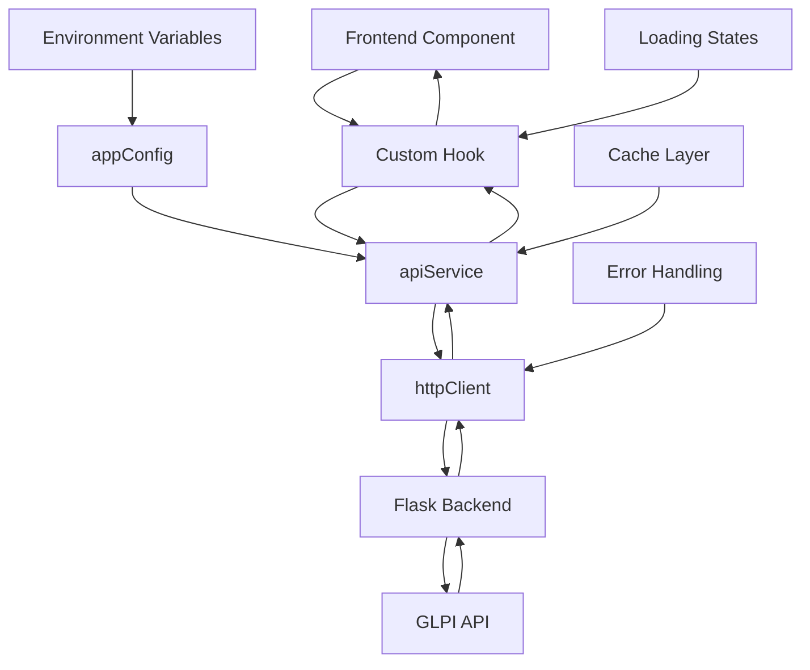

# Documentação de Endpoints - GLPI Dashboard

## Visão Geral
Este diretório contém a documentação completa de todos os endpoints do backend (Flask API) e componentes do frontend (React/TypeScript) do sistema GLPI Dashboard.

## Estrutura da Documentação

### Backend Endpoints (Flask API)

#### Endpoints Principais
- [**/** (Root)](./backend_root.md) - Endpoint raiz da API
- [**/metrics**](./backend_metrics.md) - Métricas do sistema GLPI
- [**/technicians/ranking**](./backend_technicians_ranking.md) - Ranking de técnicos
- [**/tickets/new**](./backend_tickets_new.md) - Tickets novos/recentes
- [**/technician-performance**](./backend_technician_performance.md) - Performance de técnicos
- [**/alerts**](./backend_alerts.md) - Alertas do sistema

#### Endpoints de Sistema
- [**/health**](./backend_health.md) - Health check da API
- [**/status**](./backend_status.md) - Status do sistema
- [**/openapi.yaml**](./backend_openapi.md) - Documentação OpenAPI/Swagger

### Frontend Components (React/TypeScript)

#### Hooks de Dados
- [**useMetrics**](./frontend_useMetrics.md) - Hook para métricas do sistema
- [**useRanking**](./frontend_useRanking.md) - Hook para ranking de técnicos
- [**useTickets**](./frontend_useTickets.md) - Hook para tickets novos

#### Serviços e Configurações
- [**apiService**](./frontend_apiService.md) - Serviço principal de API
- [**httpClient**](./frontend_httpClient.md) - Cliente HTTP base (Axios)
- [**appConfig**](./frontend_appConfig.md) - Configurações da aplicação

## Mapa de Integração Backend ↔ Frontend

| Backend Endpoint | Frontend Hook/Service | Status |
|------------------|----------------------|--------|
| `GET /` | `apiService.getRoot()` | ✅ Implementado |
| `GET /metrics` | `useMetrics()` → `apiService.getMetrics()` | ✅ Implementado |
| `GET /technicians/ranking` | `useRanking()` → `apiService.getTechnicianRanking()` | ✅ Implementado |
| `GET /tickets/new` | `useTickets()` → `apiService.getNewTickets()` | ✅ Implementado |
| `GET /technician-performance` | `apiService.getTechnicianPerformance()` | ⚠️ Sem hook |
| `GET /alerts` | `apiService.getAlerts()` | ⚠️ Sem hook |
| `GET /health` | `apiService.getHealth()` | ⚠️ Sem hook |
| `GET /status` | `apiService.getSystemStatus()` | ⚠️ Sem hook |
| `GET /openapi.yaml` | - | ❌ Não consumido |

## Análise de Consistência

### ✅ Pontos Fortes
- **Padronização de resposta**: Todos os endpoints retornam JSON estruturado
- **Tipagem TypeScript**: Interfaces bem definidas no frontend
- **Tratamento de erro**: Padrão consistente de error handling
- **Configuração centralizada**: `appConfig` centraliza todas as configurações
- **Hooks reutilizáveis**: Lógica de estado encapsulada
- **Cliente HTTP único**: `httpClient` com interceptadores globais

### ⚠️ Pontos de Atenção
- **Hooks incompletos**: Nem todos os endpoints têm hooks correspondentes
- **Validação de dados**: Falta validação robusta de schemas
- **Cache**: Implementação básica, pode ser melhorada
- **Retry logic**: Apenas no nível do httpClient
- **Loading states**: Implementação manual em cada hook

### ❌ Problemas Identificados
- **Inconsistência de nomes**: Alguns campos têm nomes diferentes entre backend/frontend
- **Falta de documentação OpenAPI**: Endpoint existe mas não é usado
- **Sem versionamento de API**: Não há controle de versão dos endpoints
- **Tratamento de mock data**: Lógica espalhada, deveria ser centralizada
- **Configuração de ambiente**: Algumas variáveis não são validadas

## Sugestões de Melhorias Gerais

### 1. Padronização de Schemas
```typescript
// Criar schemas compartilhados
interface ApiResponse<T> {
  data: T;
  success: boolean;
  message?: string;
  timestamp: string;
  version: string;
}

interface ApiError {
  error: string;
  code: number;
  details?: any;
  timestamp: string;
}
```

### 2. Validação com Zod
```typescript
import { z } from 'zod';

// Schema para métricas
const MetricsSchema = z.object({
  total_tickets: z.number(),
  open_tickets: z.number(),
  closed_tickets: z.number(),
  pending_tickets: z.number(),
  data_source: z.string(),
  is_mock_data: z.boolean()
});

// Validar resposta
const validateMetrics = (data: unknown) => {
  return MetricsSchema.parse(data);
};
```

### 3. Cache Inteligente
```typescript
class ApiCache {
  private cache = new Map<string, { data: any; timestamp: number; ttl: number }>();
  
  set(key: string, data: any, ttl: number = 300000): void {
    this.cache.set(key, {
      data,
      timestamp: Date.now(),
      ttl
    });
  }
  
  get(key: string): any | null {
    const item = this.cache.get(key);
    if (!item) return null;
    
    if (Date.now() - item.timestamp > item.ttl) {
      this.cache.delete(key);
      return null;
    }
    
    return item.data;
  }
}
```

### 4. Hook Genérico
```typescript
function useApiData<T>(
  endpoint: string,
  options: {
    enabled?: boolean;
    refetchInterval?: number;
    cacheTime?: number;
  } = {}
) {
  const [data, setData] = useState<T | null>(null);
  const [loading, setLoading] = useState(false);
  const [error, setError] = useState<string | null>(null);
  
  // Implementação genérica...
  
  return { data, loading, error, refetch };
}

// Uso específico
const useMetrics = () => useApiData<MetricsResponse>('/metrics');
const useRanking = () => useApiData<RankingResponse>('/technicians/ranking');
```

### 5. Versionamento de API
```typescript
// Backend
app.register_blueprint(api_v1, url_prefix='/api/v1')
app.register_blueprint(api_v2, url_prefix='/api/v2')

// Frontend
const apiConfig = {
  baseURL: `${appConfig.api.url}/api/v1`,
  version: 'v1'
};
```

## Variáveis de Ambiente

### Backend (Flask)
```bash
# Obrigatórias
GLPI_URL=https://glpi.exemplo.com
GLPI_USER_TOKEN=seu_token_aqui
GLPI_APP_TOKEN=seu_app_token_aqui

# Opcionais
FLASK_ENV=development
FLASK_DEBUG=True
PORT=5000
CORS_ORIGINS=http://localhost:3000
CACHE_TTL=300
REQUEST_TIMEOUT=30
```

### Frontend (React/Vite)
```bash
# Obrigatórias
VITE_API_URL=http://localhost:5000

# Opcionais
VITE_API_TIMEOUT=10000
VITE_NODE_ENV=development
VITE_APP_VERSION=1.0.0
VITE_DEBUG_MODE=true
VITE_AUTO_REFRESH_ENABLED=true
VITE_AUTO_REFRESH_INTERVAL=30000
```

## Fluxo de Dados



## Comandos Úteis

### Desenvolvimento
```bash
# Backend
cd backend
python app.py

# Frontend
cd frontend
npm run dev

# Documentação
# Gerar documentação OpenAPI
curl http://localhost:5000/openapi.yaml > docs/openapi.yaml

# Testar endpoints
curl http://localhost:5000/health
curl http://localhost:5000/metrics
```

### Testes
```bash
# Backend
pytest tests/

# Frontend
npm test
npm run test:coverage

# E2E
npm run test:e2e
```

## Próximos Passos

### Prioridade Alta
1. **Implementar hooks faltantes** - Para endpoints sem hooks
2. **Validação de schemas** - Zod ou similar
3. **Tratamento de erro padronizado** - Error boundaries
4. **Cache inteligente** - Invalidação automática
5. **Documentação OpenAPI** - Swagger UI

### Prioridade Média
6. **Versionamento de API** - Controle de versão
7. **Testes automatizados** - Unit e integration
8. **Monitoramento** - Logs e métricas
9. **Performance** - Otimizações de rede
10. **Segurança** - Autenticação e autorização

### Prioridade Baixa
11. **Internacionalização** - i18n
12. **Tema escuro** - Dark mode
13. **PWA** - Progressive Web App
14. **Notificações** - Push notifications
15. **Export de dados** - CSV, PDF, Excel

---

**Última atualização**: Janeiro 2024  
**Versão da documentação**: 1.0.0  
**Autor**: Análise Técnica de APIs